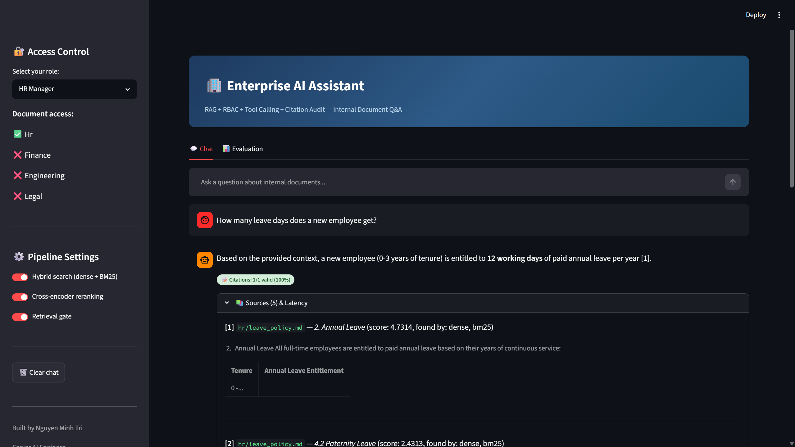
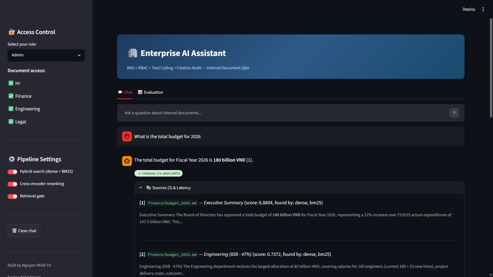
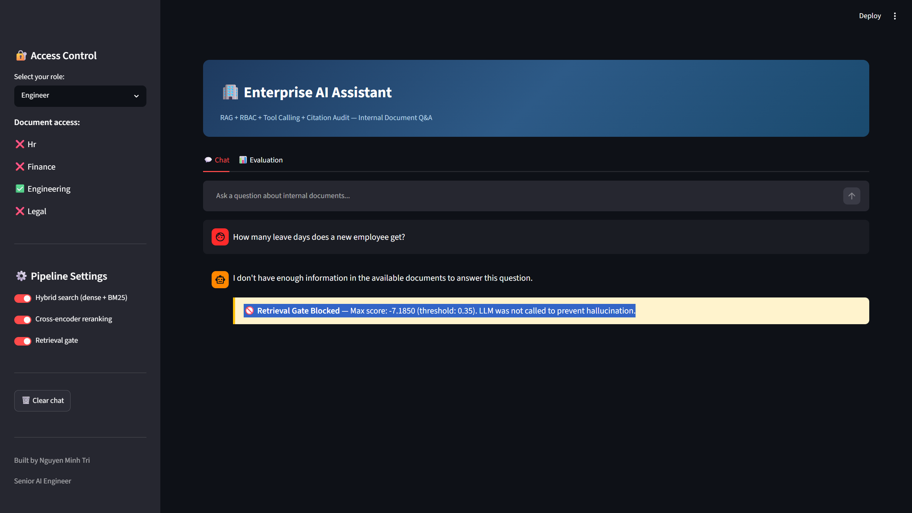
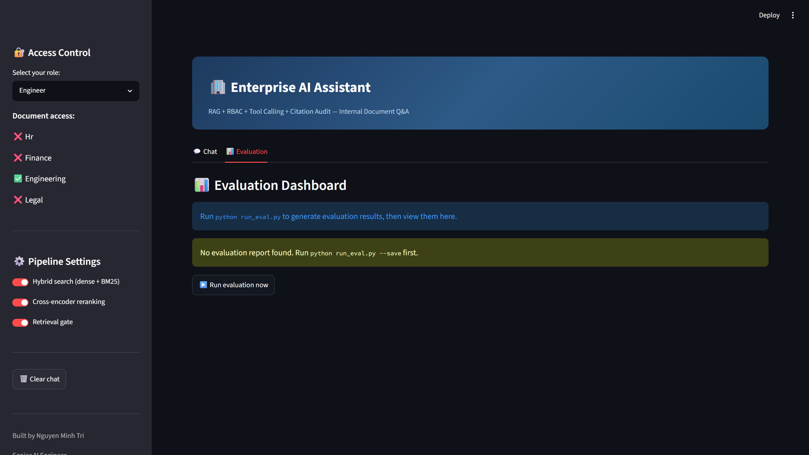

# 🏢 Enterprise RAG Assistant

An enterprise-grade Internal AI Assistant that answers employee questions over internal documents with **role-based access control**, **tool calling**, **anti-hallucination guardrails**, and a built-in **evaluation harness**.

Built as a realistic demo of the patterns enterprise AI teams actually ship — not another "embed and pray" tutorial.

## Screenshots

### HR Manager — Leave Policy Q&A with Citation


### Admin — Cross-Department Budget Query


### Engineer — RBAC Blocks Unauthorized Access



### Evaluation Dashboard


## Key Features

| Feature | What It Does | Why It Matters |
|---------|-------------|----------------|
| **RBAC (Role-Based Access Control)** | Pre-retrieval filtering — unauthorized chunks never enter the pipeline | Prevents data leakage at the vector DB level, not post-hoc |
| **Hybrid Retrieval** | Dense (Qdrant) + Sparse (BM25) + Reciprocal Rank Fusion | Catches both semantic matches and exact keyword hits |
| **Cross-Encoder Reranking** | ms-marco-MiniLM reranker on fused candidates | Precision boost over raw retrieval scores |
| **Retrieval Gate** | Score threshold before LLM generation | Prevents hallucination at the root — no relevant docs = no answer |
| **Tool Calling** | Calculator (AST-safe) + SQL Executor (read-only SQLite) | Routes structured queries to tools instead of letting the LLM guess |
| **Citation Audit** | Post-generation verification of `[1]`, `[2]` references | Catches the LLM citing non-existent sources |
| **Evaluation Harness** | 44 golden Q&A pairs across 7 metrics | Automated regression testing for retrieval + generation quality |

## Architecture

```
User Query → Auth (RBAC) → Intent Router
                              │
                ┌─────────────┼─────────────┐
                ▼             ▼              ▼
           RAG Pipeline    SQL Tool     Calculator
                │
     ┌──────────┴──────────┐
     ▼                     ▼
  Dense Search          BM25 Search
  (Qdrant +             (rank-bm25 +
   role filter)          role filter)
     │                     │
     └──────┬──────────────┘
            ▼
     RRF Fusion → Reranker → Retrieval Gate
                                  │
                          ┌───────┴───────┐
                          ▼               ▼
                     Gate PASS       Gate BLOCK
                          │          "No info found"
                          ▼
                   LLM Generation
                   (DeepSeek + citation prompt)
                          │
                          ▼
                   Citation Audit
                          │
                          ▼
                      Answer + Sources
```

## Quick Start

### Prerequisites
- Python 3.11+
- Docker (for Qdrant)
- DeepSeek API key (or any OpenAI-compatible provider)

### Setup

```bash
# 1. Clone and install
git clone https://github.com/Boothill2001/Enterprise_RAG_Assistant.git
cd Enterprise_RAG_Assistant
pip install -r requirements.txt

# 2. Start Qdrant
docker compose up -d

# 3. Configure
cp .env.example .env
# Edit .env with your DeepSeek API key

# 4. Build index
python build_index.py

# 5. Run the app
streamlit run app.py
```

## RBAC Demo

The system enforces document access at the **vector database level** (pre-retrieval filter), not post-hoc:

| Role | Accessible Documents | Example |
|------|---------------------|---------|
| HR Manager | HR policies, salary bands, benefits | ✅ "What is the maternity leave policy?" |
| Accountant | Revenue reports, expense policy, invoices | ✅ "What was Q3 revenue?" |
| Engineer | API guidelines, incident playbook, infra docs | ✅ "What is the SLA for SEV1?" |
| Legal Counsel | NDA templates, contracts, compliance | ✅ "What is the NDA duration?" |
| Admin | All documents | ✅ Full access |

**Security test:** An Engineer asking about salary bands gets "I don't have enough information" — the HR chunks were never retrieved, not filtered after retrieval.

## Tool Calling

Structured queries are routed to tools instead of RAG:

- **Calculator** (AST-safe, no `eval()`): "Calculate 15% VAT on 340M VND" → `51,000,000`
- **SQL Executor** (read-only SQLite): "Total revenue Q3 2025?" → Generates SQL, executes against the database, formats the answer

The intent router uses keyword + regex matching to classify queries. Default fallback is always RAG (safe).

## Evaluation

44 golden Q&A pairs covering:
- 34 RAG questions (across 4 departments)
- 4 SQL questions
- 2 calculator questions
- 2 out-of-scope questions (expect refusal)
- 2 RBAC leak tests (expect refusal)

```bash
python run_eval.py
```

| Metric | Target | Description |
|--------|--------|-------------|
| Hit rate @5 | ≥ 95% | Ground-truth chunk in top-5 results |
| Citation accuracy | ≥ 90% | Valid `[N]` references in answers |
| Refusal accuracy | ≥ 90% | Correctly refuses out-of-scope |
| RBAC leak rate | 0% | Never leaks unauthorized documents |
| Tool routing accuracy | ≥ 90% | Routes SQL/calc to correct tool |

## Tech Stack

- **Vector DB:** Qdrant (with payload filtering for RBAC)
- **Embedding:** all-MiniLM-L6-v2 (384-dim)
- **Reranker:** cross-encoder/ms-marco-MiniLM-L-6-v2
- **LLM:** DeepSeek (configurable via OpenAI-compatible API)
- **Retrieval:** Hybrid (dense + BM25 + RRF)
- **UI:** Streamlit
- **Database:** SQLite (for structured data queries)

## Project Structure

```
├── data/
│   ├── docs/{hr,finance,engineering,legal}/   # 18 enterprise documents
│   ├── permissions.json                       # role → department mapping
│   ├── seed_db.sql                           # structured data seed
│   └── eval/golden_qa.json                   # 44 evaluation Q&A pairs
├── src/
│   ├── ingestion/    # chunking, metadata, embedding, Qdrant indexing
│   ├── retrieval/    # hybrid search, reranking, retrieval gate
│   ├── generation/   # LLM generation, citation audit
│   ├── tools/        # calculator, SQL executor, intent router
│   ├── auth/         # RBAC
│   └── eval/         # evaluation harness & metrics
├── app.py            # Streamlit UI (Chat + Evaluation tabs)
├── build_index.py    # Offline indexing script
└── run_eval.py       # Evaluation CLI
```

## Related Projects

This is part of a 3-project GenAI portfolio:

1. **[Advanced RAG](https://github.com/Boothill2001/RAG_project)** — Hybrid search + re-ranking fundamentals
2. **[Research Copilot](https://github.com/Boothill2001/AI_AGENT_LANGGHAPH)** — LangGraph agent + MCP + human-in-the-loop
3. **Enterprise RAG Assistant** (this repo) — Production patterns: RBAC, tool calling, retrieval gate, evaluation

## Author

**Nguyen Minh Tri** — Senior AI Engineer focused on shipping LLM systems that survive real users and real traffic.

- Email: <minhtri.cm2001@gmail.com>
- [LinkedIn](https://www.linkedin.com/in/minhtri-nguyen-cm2001)
- [GitHub](https://github.com/Boothill2001)
